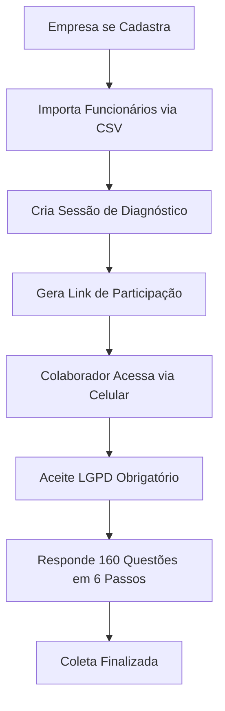
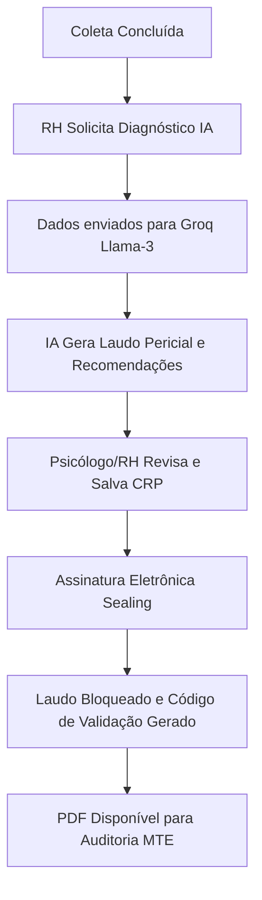

# Guia Mestre do Sistema SIMDCCONR01
## Fluxo de Operação, Tecnologias e Perfis de Usuário

Este documento serve como a fonte única de verdade para o funcionamento do SaaS NR-01, detalhando a jornada do usuário, a infraestrutura técnica e o motor de Inteligência Artificial.

---

## 🛠️ 1. Stack Tecnológica (Modernidade e Escalabilidade)

O sistema foi concebido para alta performance, segurança de dados (LGPD) e precisão técnica.

| Componente | Tecnologia | Finalidade |
| :--- | :--- | :--- |
| **Backend** | Python 3.12 + Django | Framework robusto para multi-tenancy e lógica de negócios. |
| **Banco de Dados** | PostgreSQL | Armazenamento relacional seguro com suporte a JSONFields. |
| **Inteligência Artificial** | Groq API (Llama-3.3-70b) | Diagnóstico pericial ultra-rápido e análise de sentimentos. |
| **Geração de PDF** | WeasyPrint + Jinja2 | Relatórios de alta fidelidade baseados em HTML/CSS. |
| **Gráficos** | SVG Dinâmico (Native Python) | Visualizações vetoriais leves e nítidas embutidas nos laudos. |
| **Interface** | Bootstrap 5 + Vanilla JS | Experiência de usuário fluida com suporte a Modo Dark/Light. |
| **Hospedagem** | Railway | Deploy contínuo e infraestrutura de nuvem moderna. |

---

## 👤 2. Perfis de Usuário e Permissões

### 👑 Administrador Master (SaaS Owner)
*   **Ações Principal**: Gestão de empresas parceiras, monitoramento global de faturamento, edição da Landing Page.
*   **Visão**: Dashboard consolidado de todas as organizações no sistema.
*   **Auditoria**: Acesso aos logs de sistema (AuditLog) para rastreabilidade total.

### 🏢 Administrador da Empresa (RH / SST / Proprietário)
*   **Gestão de Equipe**: Importação em massa de funcionários via CSV ou cadastro manual.
*   **Configuração de Sessão**: Criação de `FormSession` para as 3 NRs (IMCO, FDAC, NR01).
*   **Monitoramento**: Acompanhamento em tempo real da taxa de resposta (Participação).
*   **Relatórios**: Geração de laudos PDF integrados e diagnósticos individuais por IA.
*   **Assinatura**: Capacidade de assinar digitalmente o laudo (Interna/Gov.br) após informar o CRP.

### 👤 Colaborador (Funcionário)
*   **Coleta de Dados**: Resposta às 160 questões de forma intuitiva em dispositivos móveis ou desktop.
*   **Privacidade (LGPD)**: Aceite obrigatório de termos para análise individual e agregada.
*   **Anonimato**: Possibilidade de participação anônima para garantir a sinceridade na Pesquisa de Clima.

---

## 🔄 3. Fluxogramas de Operação

### A. Jornada de Onboarding e Coleta

### B. Fluxo de Inteligência Artificial e Assinatura

---

## 🛡️ 4. Validação de Documentos

Para garantir a total segurança contra fraudes, cada laudo assinado possui um **UUID Único** (Ex: `550e8400-e29b-41d4-a716-446655440000`).

1.  **Inserção**: Na Home Page Pública, existe um campo "Validador de Laudos".
2.  **Verificação**: O fiscal ou RH insere o código.
3.  **Prova**: O sistema exibe instantaneamente a data da assinatura, o profissional responsável e se o documento é autêntico.

---

## 🚀 5. Como usar o sistema (Guia Rápido de 3 Passos)

### **Passo 1: Preparação**
No menu **Funcionários**, use o botão "Importar CSV" para cadastrar toda a sua base. Isso garante que cada colaborador tenha um acesso único e rastreável conforme a NR-01.

### **Passo 2: A Coleta**
Vá em **Sessões de Formulário** e clique no ícone "Criar Link". Envie este link por WhatsApp ou E-mail para os colaboradores. Acompanhe a barra de progresso para ver quem já respondeu.

### **Passo 3: A Inteligência**
Após o fechamento da coleta, acesse **Relatórios** e selecione o botão "Diagnóstico IA". O sistema processará todas as dissonâncias de cultura e clima, entregando um PDF assinado pronto para ser anexado ao seu PGR/GRO.

---

**© 2026 SaaS NR-01 - Tecnologia a serviço da saúde mental corporativa.**
